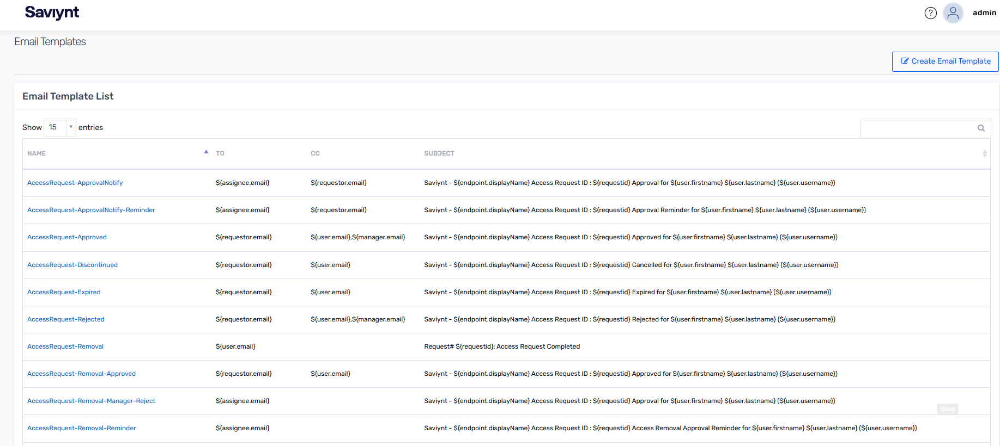

# E-mail Template

**Disclaimer**

This Artifact was either created by Saviynt or by Saviynt Community users and is an export from the Saviynt Identity Cloud (IC) environment. It can be imported to any Saviynt environment.

If the same name of an object is already available in your environment, please follow these steps:

1. Unzip the downloaded file.
2. Open the JSON file and change the name of the object under "class of object" listed under "Objects".
3. Zip the file again to upload it to your environment.

**Note:** This guide provides information about using the sample listed Artifact only.

## Introduction

**E-mail Template** is a standard object used to share the status of various operations with Users. These templates are commonly used for notifications, alerts, and other information/status sharing. This collection contains 10 email templates used for Access Request Approval and Rejection Workflows.

**Email Templates:**

* AccessRequest-ApprovalNotify
* AccessRequest-ApprovalNotify-Reminder
* AccessRequest-Approved
* AccessRequest-Discontinued
* AccessRequest-Expired
* AccessRequest-Rejected
* AccessRequest-Removal
* AccessRequest-Removal-Approved
* AccessRequest-Removal-Manager-Reject
* AccessRequest-Removal-Reminder

## Working Model

These templates can be used for various purposes. In this collection, they are used for two workflows to send notifications based on the status of an Access Request.

## Prerequisites

| Object | Purpose |
|---|---|
| N/A | N/A |

## Integration Steps

1. As an Admin, navigate to the **Transport** module in the Saviynt UI.
2. Click on **Import Package**.
3. Choose the package to import (select the ZIP file).
4. Enter a **Business Justification** for the import (e.g., "Importing Access Request Email Templates").
5. Click on "**View Summary**".
6. Review the summary and click on "**REQUEST**" to import the package.

## Troubleshooting

* **Workflow might not be added in Transport:** Verify that the imported workflows are added to the appropriate transport configuration within the Saviynt UI.
* **SMTP is not configured:** Ensure that your Saviynt environment has a properly configured SMTP server to send email notifications.
